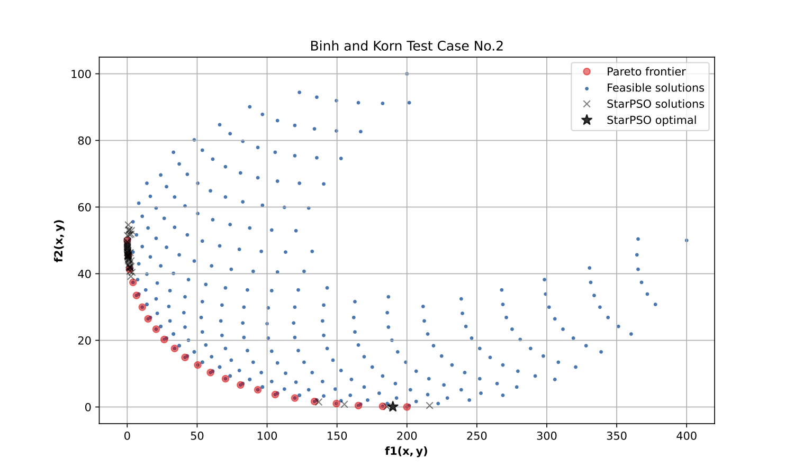

Binh and Korn
=============

Description:

    - Optimization (min)
    - Multi-objective (2)
    - Constraints (2)

The general problem statement is given by:

    .. math::
        \begin{cases}
              f_{1}\left(x,y\right) = 4x^{2} + 4y^{2} \\
              f_{2}\left(x,y\right) = \left(x - 5\right)^{2} + \left(y - 5\right)^{2} \\
        \end{cases}

subject to:

    .. math::
        \begin{cases}
              C_{1}\left(x,y\right) = \left(x - 5\right)^{2} + y^{2} \leq 25, \\
              C_{2}\left(x,y\right) = \left(x - 8\right)^{2} + \left(y + 3\right)^{2} \geq 7.7 \\
        \end{cases}

where: :math:`-15\le x \le 30` and :math:`-15\le y \le 30`.

The Pareto-optimal solutions are constituted by solutions: :math:`x=y \in [0.0, 3.0]` and
:math:`x \in [3.0, 5.0], y=3.0.`

Step 1: Import python libraries and StarPSO classes
---------------------------------------------------

.. code-block:: python

    import numpy as np
    from functools import lru_cache
    from matplotlib import pyplot as plt
    from star_pso.population.swarm import Swarm
    from star_pso.population.particle import Particle
    from star_pso.engines.standard_pso import StandardPSO
    from star_pso.utils.auxiliary import pareto_front, cost_function

Step 2: Define the objective function
-------------------------------------

.. code-block:: python

    # Auxiliary method that returns a random value in [0, 1].
    @lru_cache(maxsize=1024)
    def random_weight(i: int = 0) -> float:
        return np.random.random()

    # Multi-objective cost function.
    @cost_function(minimize=True)
    def fun_binh_korn(vector_xy: np.ndarray, **kwargs) -> float:

        # Set the penalty coefficient.
        rho = 5.0

        # Extract the values from the particle position.
        x, y = vector_xy

        # Compute each objective function.
        f1 = 4.0 * (x**2 + y**2)
        f2 = (x - 5.0)**2 + (y - 5.0)**2

        # Compute the constraints.
        C1 = max(0.0, (x - 5.0)**2 + y**2 - 25.0)**2
        C2 = min(0.0, (x - 8.0)**2 + (y + 3.0)**2 - 7.7)**2

        # Assign the weights.
        w1 = random_weight(kwargs["it"])
        w2 = 1.0 - w1

        # Compute the final value.
        f_value = w1*f1 + w2*f2 + rho*(C1 + C2)

        # Return the solution.
        return f_value

Step 3: Set the PSO parameters
------------------------------

.. code-block:: python

    # Set a seed for reproducible initial population.
    SEED = 1821

    # Random number generator.
    rng = np.random.default_rng(SEED)

    # Define the number of optimizing variables.
    n_dim = 2

    # Define the number of particles.
    n_pop = 100

    # Draw random samples for the initial points.
    X_t0 = rng.uniform(-15.0, 30.0, size=(n_pop, n_dim))

    # Initial population.
    swarm_t0 = Swarm([Particle(x) for x in X_t0])

    # Create a StandardPSO object that will perform the optimization.
    test_PSO = StandardPSO(initial_swarm = swarm_t0,
                           obj_func = fun_binh_korn,
                           x_min = -15.0, x_max = 30.0)

Step 4: Run the optimization
----------------------------

.. code-block:: python

    test_PSO.run(max_it = 1500,
                 options = {"w0": 0.70, "c1": 1.50, "c2": 1.50, "mode": "g_best"},
                 reset_swarm = False, verbose = False, adapt_params = False)

Step 5: Extract the data for analysis and plotting
--------------------------------------------------

.. code-block:: python

    # Get the optimal solution from the PSO.
    _, _, z_opt = test_PSO.get_optimal_values()

    # Extract the optimal optimization variables.
    x, y = z_opt

    # Compute the final objective functions.
    f1_opt = 4.0 * (x**2 + y**2)
    f2_opt = (x - 5.0)**2 + (y - 5.0)**2

    # Print the results.
    print(f"x={x:.5f}, y={y:.5f}", end='\n\n')
    print(f"f1(x, y) = {f1_opt:.5f}")
    print(f"f2(x, y) = {f2_opt:.5f}")

    # Stores the best positions.
    best_n = []

    for p in test_PSO.swarm.best_n(n_pop//2):
        # Extract the position.
        x_p, y_p = p.best_position

        # Compute the final objective functions.
        best_n.append((4.0*(x_p**2 + y_p**2),
                      (x_p - 5.0)**2 + (y_p - 5.0)**2))

    # Convert to numpy.
    best_n = np.array(best_n)

Step 6: Compute the Pareto front
--------------------------------

.. code-block:: python

    # Create a list that will hold points that satisfy both constraints.
    points = []

    # Generate a 2D grid sample on [-15.0, 30].
    for x in np.linspace(-15.0, 30.0, 100):

        for y in np.linspace(-15.0, 30.0, 100):

            # Compute the constraints.
            C1 = (x - 5.0)**2 + y**2 <= 25.0
            C2 = (x - 8.0)**2 + (y + 3.0)**2 >= 7.7

            # If both constraints are satisfied.
            if C1 and C2:

                # Evaluate both functions.
                f1 = 4.0 * (x**2 + y**2)
                f2 = (x - 5.0)**2 + (y - 5.0)**2

                # Keep the point in the list.
                points.append((f1, f2))
    # _end_for_

    # Convert lists to numpy.
    points = np.array(points)

    # Estimate the pareto front points.
    pareto_points = pareto_front(points)

Step 6: Visualize the solutions
-------------------------------

.. code-block:: python

    # Create a new figure.
    plt.figure(figsize=(10, 6))

    # Plot the Pareto front.
    plt.plot(pareto_points[:, 0],
             pareto_points[:, 1],
             'ro', alpha=0.5, label="Pareto frontier")

    # Plot all the feasible solutions.
    plt.scatter(x=points[:, 0],
                y=points[:, 1],
                s=5, marker='o', label="Feasible solutions")

    # Plot other points.
    plt.plot(best_n[:, 0],
             best_n[:, 1],
             'kx', alpha=0.5, label="StarPSO solutions")

    # Plot the optimal solution from the PSO.
    plt.plot(f1_opt, f2_opt,
             'k*', markersize=10, alpha=0.8, label="StarPSO optimal")

    # Tidy up the plot.
    plt.title("Binh and Korn Test Case No.2")
    plt.xlabel(r"$\mathbf{f1(x,y)}$")
    plt.ylabel(r"$\mathbf{f2(x,y)}$")
    plt.legend()
    plt.grid(True)

